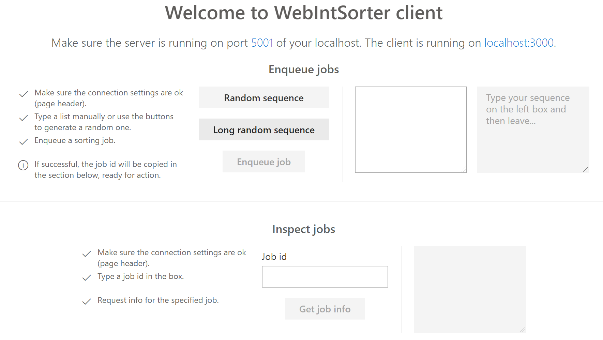

# React client - A simple web client for WebIntSorter
This is a minimal web client allowing interaction with WebIntSorter by using your favorite browser.

## Requirements
To be able to run this web application, you need the following:

- NPM ^6.4.1.
- Node ^10.15.0.
- A browser (latest version) among: Chrome, Edge, Firefox.

## Get
To get the client, you either [clone the Challenges repository](https://github.com/andry-tino/coding-challenges.git), or get the latest _WebIntSorter ReactClient_ release from [releases](https://github.com/andry-tino/coding-challenges/releases).

## Run
After getting the code, in the project directory, run:

```
npm install
```

This will install all required Node modules. Then run:

```
npm run build
```

This will create a production build. Afterwards, install _serve_:

```
npm install -g serve
```

Once installed, run:

```
serve -s build -l 3000
```

Open up your favorite browser, and navigate to: `http://localhost:3000`.



The client is ready to be used.

### Important
The WebIntSorter server is configured to support CORS only for the following requesting hosts:

- `http://localhost:3000`

You should serve the client from your `localhost` port `3000`, otherwise it will properly work.
